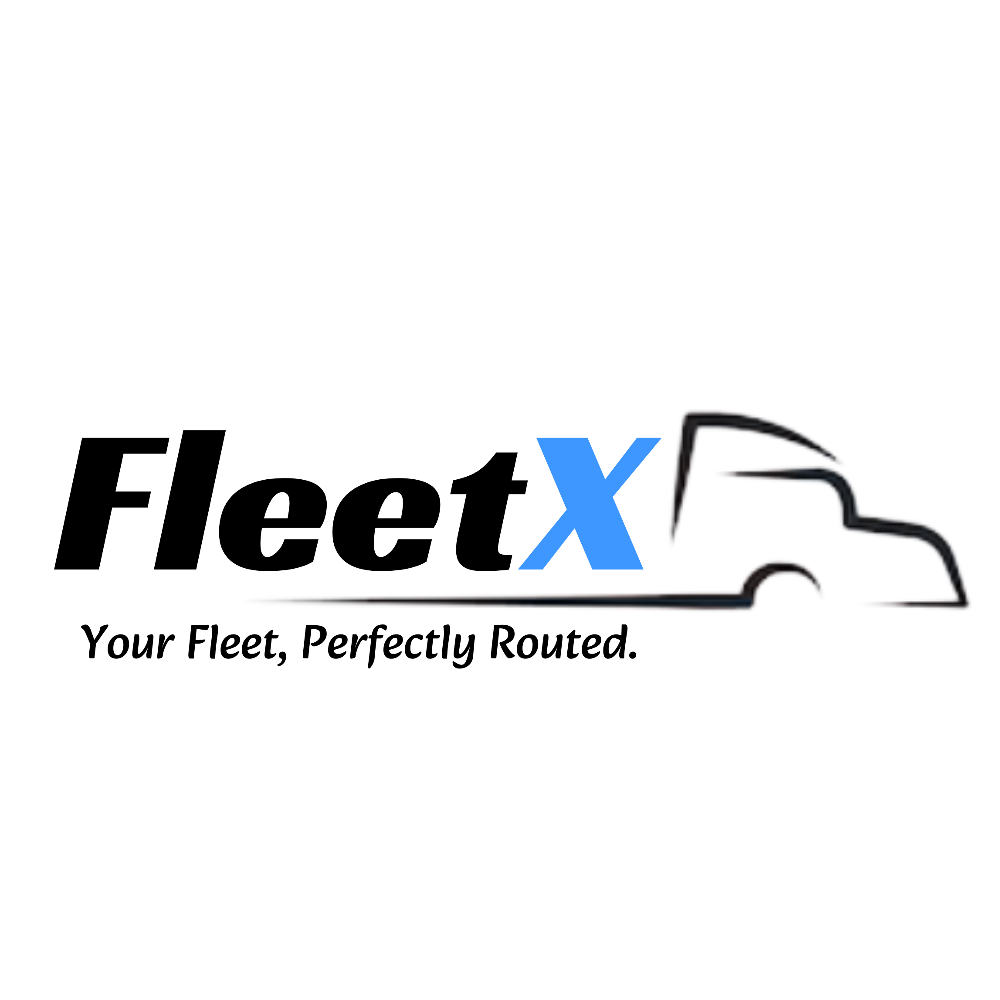
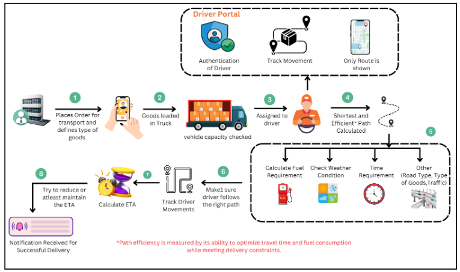

# 🚛 FleetX – Your Fleet, Perfectly Optimized

<p align="center">
  
</p>

FleetX is a real-time fleet route optimization solution designed for logistics companies to minimize delivery time, fuel costs, and inefficiencies through intelligent routing and multi-vehicle coordination.

## 🧠 Problem Statement

Logistics companies often face high travel distances, unpredictable delays, and inefficient manual route planning. FleetX solves this by dynamically optimizing delivery routes based on real-time traffic, vehicle capacity, and delivery priorities.

---

## ✨ Features
<p align="center">
  
</p>

- 📍 **Smart Route Planning** using OpenRouteService (ORS)
- 🚦 **Real-Time Traffic-Based Adjustments**
- 🚚 **Multi-Vehicle Optimization**
- 📦 **Goods & Load Tracking**
- ⏱ **Accurate ETA Calculation**
- 🌐 **WebSocket-Based Live Room Tracking**
- 🔄 **Dynamic Dispatch Assignment**
- 📲 **Driver & Admin Dashboard (Flutter)**

---

## 🛠 Tech Stack

| Component     | Tech Used                    |
|--------------|-------------------------------|
| **Frontend** | Flutter, Flutter Maps          |
| **Backend**  | Firebase (Firestore, Auth, RTDB) |
| **Routing API** | OpenRouteService (ORS – Directions API) |
| **Live Updates** | WebSockets for room-based tracking |
| **Deployment** | Render (Backend Hosting) |

---

## 🧪 MVP Scope

- Real-time optimized route generation
- Support for multiple delivery stops
- Live fleet tracking with ETA updates
- Goods addition & tracking by dispatchers
- Scalable architecture for growing fleets

---

## ⚙️ Installation & Setup

### Clone the Repo

```bash
git clone https://github.com/hahaanisha/fleetx.git
cd fleetx
